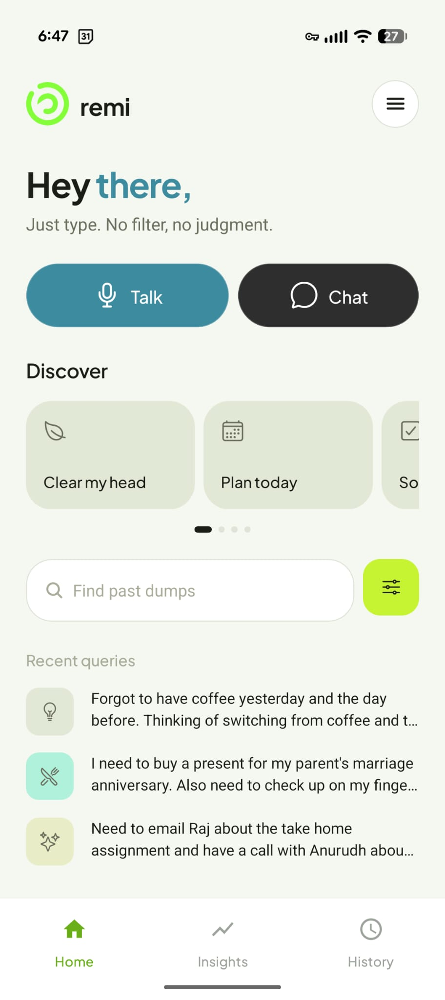
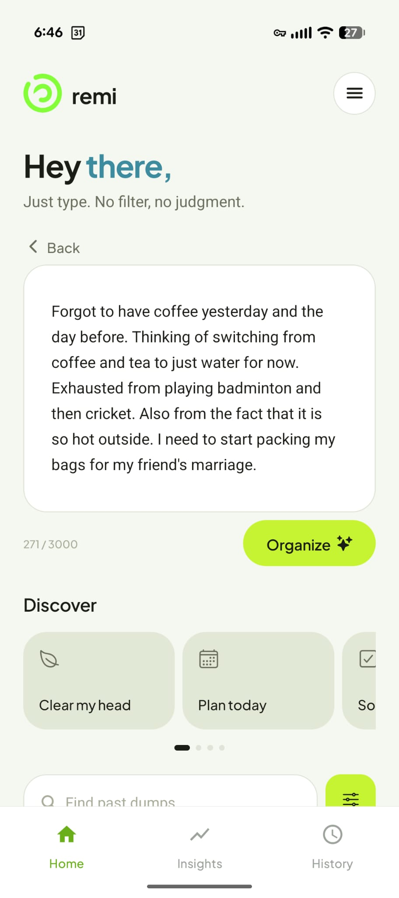
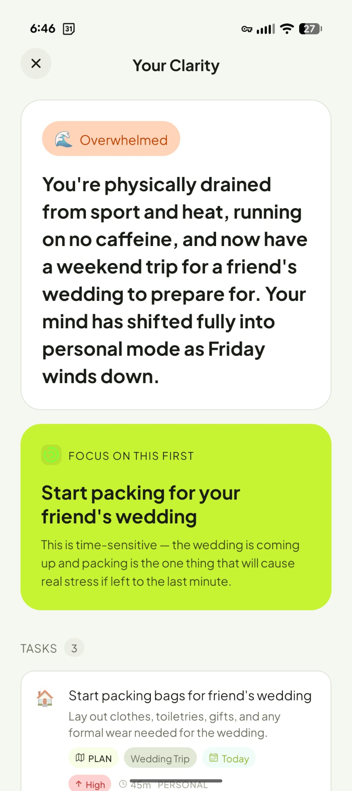
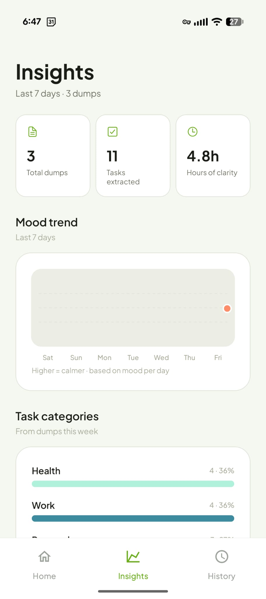
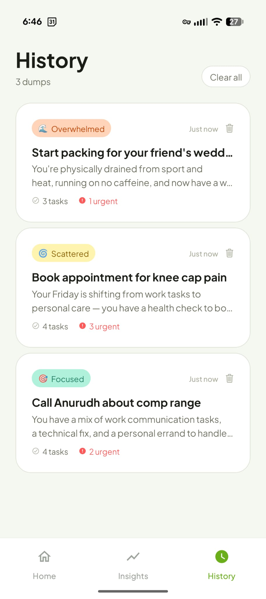

# Remi

[](LICENSE)

**Remi** is an AI thought partner: dump messy thoughts (text or voice), and get structured tasks, mood, focus, and insights. The mobile app talks to a small Express backend powered by Claude (and Whisper for transcription).

**Production API:** [https://remi-oa70.onrender.com](https://remi-oa70.onrender.com/health)

## What's in the repo

| Path | Description |
|------|-------------|
| `apps/mobile` | Expo (React Native) app — dump screen, voice, history, insights |
| `apps/backend` | Express API — `/api/process`, `/api/transcribe`, rate limiting |
| `docs/screenshots` | App screenshots for this README |

## Features

- **Brain dump → organize** — Claude turns raw text into summary, mood, focus item, and tasks (with inferred due dates, projects, action types)
- **Contextual processing** — last 3 dump summaries sent as context for pattern-aware insights
- **Voice input** — record → Whisper transcription → edit → organize
- **History** — local storage of past dumps
- **Insights** — 7-day mood trend, task categories, stats, and “your patterns”
- **Onboarding** — first-run walkthrough
- **Dev fallback** — mock parser when `ANTHROPIC_API_KEY` is unset

---

## Download APK (Android)

Install Remi on Android without the Play Store (sideload).

### Option 1 — GitHub Releases (recommended)

1. Open **[Releases](https://github.com/Maddoxx88/remi/releases)**.
2. Download the latest **`Remi-*.apk`** asset.
3. On your phone: enable **Install unknown apps** for your browser or Files app.
4. Open the APK and install.

> **Maintainers:** After `eas build -p android --profile preview`, upload the `.apk` to a new GitHub Release (tag e.g. `v1.0.0`) so the link above works for users.

### Option 2 — Expo EAS build

If you built the app yourself:

1. Run `eas build -p android --profile preview` from `apps/mobile`.
2. Open [expo.dev](https://expo.dev) → your project → **Builds** → download the APK.

### Requirements

- Android 8+ recommended
- Internet required (backend on Render)
- Microphone permission for voice dumps

---

## Screenshots

Add PNGs under [`docs/screenshots/`](docs/screenshots/) to replace placeholders below. See [`docs/screenshots/README.md`](docs/screenshots/README.md) for suggested filenames.

| Home | Chat dump | Results |
|:----:|:---------:|:-------:|
|  |  |  |

| Insights | History |
|:--------:|:-------:|
|  |  |

*Until those files are added, images may not render on GitHub. Capture from emulator or device and commit `home.png`, `chat.png`, `results.png`, `insights.png`, `history.png`.*

---

## Prerequisites

- **Node.js** 20+ and npm
- **Expo Go** on a physical device, or iOS Simulator / Android emulator
- API keys (see below)
- For **release builds**: [Expo account](https://expo.dev/signup) (free tier works) and [EAS CLI](https://docs.expo.dev/build/setup/)

---

## Local development

### 1. Backend

```bash
cd apps/backend
cp .env.example .env
```

Edit `.env`:

```env
ANTHROPIC_API_KEY=sk-ant-...          # Required for real AI processing
OPENAI_API_KEY=sk-...                 # Required for voice transcription
ANTHROPIC_MODEL=claude-sonnet-4-6     # Optional
PORT=3001
```

```bash
npm install
npm run dev
```

Server runs at `http://localhost:3001`. Health check: `GET /health`.

Without `ANTHROPIC_API_KEY`, the process route uses a local mock parser (fine for UI dev).

### 2. Mobile app

```bash
cd apps/mobile
npm install
npx expo start
```

- Press `i` / `a` for simulator, or scan the QR code with **Expo Go**.
- In dev, the app picks the API host from the Metro debugger (same machine as Expo). Android emulator uses `10.0.2.2:3001`; iOS simulator uses `localhost:3001`.
- **Physical device**: phone and laptop must be on the same Wi‑Fi; backend must listen on `0.0.0.0` (default for `npm run dev`).

### 3. Production API URL

Release builds use `EXPO_PUBLIC_API_URL` (see `apps/mobile/eas.json`) or the fallback in `apps/mobile/services/config.ts` (`https://remi-oa70.onrender.com`).

**Deploy backend:** [Render](https://render.com) using the repo’s `render.yaml` — details in [`apps/backend/DEPLOY.md`](apps/backend/DEPLOY.md).

---

## Build an Android APK

```bash
npm install -g eas-cli
eas login
cd apps/mobile
eas build:configure   # once — use buildType "apk" under preview
eas build -p android --profile preview
```

Download from [expo.dev](https://expo.dev) → **Builds**, then upload to [GitHub Releases](https://github.com/Maddoxx88/remi/releases) for public download.

Full build notes (local Gradle, Play Store AAB) are in earlier sections of this doc or [`apps/backend/DEPLOY.md`](apps/backend/DEPLOY.md).

### App icons

```bash
cd apps/mobile
# Replace assets/remi-logo.png if needed, then:
npm run generate-icons
```

---

## Publishing checklist

- [ ] Production API URL set (`EXPO_PUBLIC_API_URL` / Render deploy)
- [ ] Backend secrets on host only (never in git)
- [ ] Bump `version` in `apps/mobile/app.json`
- [ ] Screenshots in `docs/screenshots/` for README / store listing
- [ ] APK attached to GitHub Release
- [ ] Test voice, organize, history, insights on a **release** build

---

## API overview

| Endpoint | Method | Description |
|----------|--------|-------------|
| `/health` | GET | Status and process mode (anthropic vs mock) |
| `/api/process` | POST | `{ text, previousContext? }` → structured dump JSON |
| `/api/transcribe` | POST | `{ audio: base64, mimeType? }` → `{ text }` |

Rate limits apply per IP on `/api/*` (see `apps/backend/src/middleware/rateLimit.ts`).

---

## Troubleshooting

| Issue | What to try |
|-------|-------------|
| Organize fails on device | Check `https://remi-oa70.onrender.com/health`; cold start on free Render can take ~30s |
| 401 from Anthropic | Valid `ANTHROPIC_API_KEY` on Render; redeploy |
| Voice fails | `OPENAI_API_KEY` on Render; microphone permission |
| Onboarding skipped | Completed once — uninstall app or clear `remi_onboarding_complete` in storage |
| Android emulator can’t reach API | Backend on host; dev uses `10.0.2.2:3001` |

---

## License

This project is licensed under the **[MIT License](LICENSE)**.

You may use, copy, modify, and distribute the code with attribution. The software is provided “as is”, without warranty.

Copyright © 2026 Sunit Shirke
